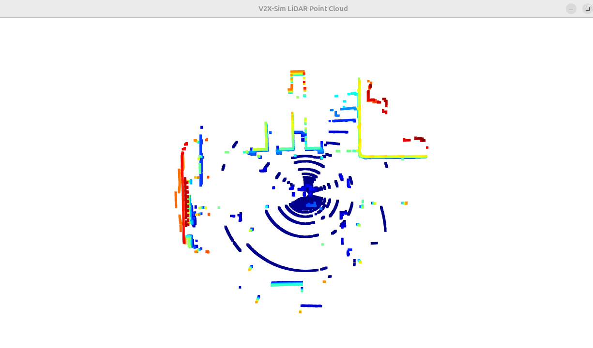
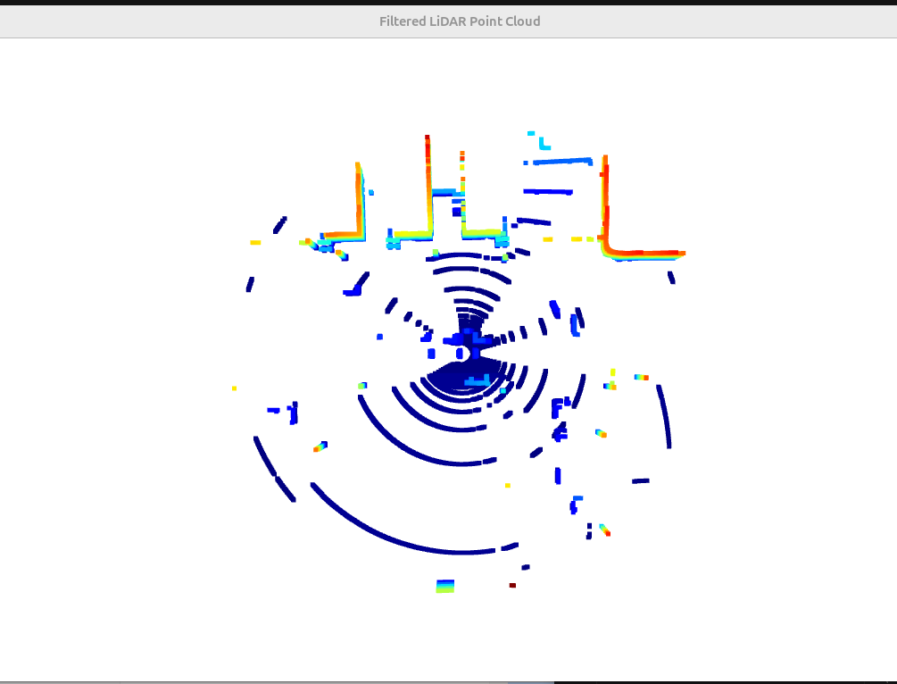
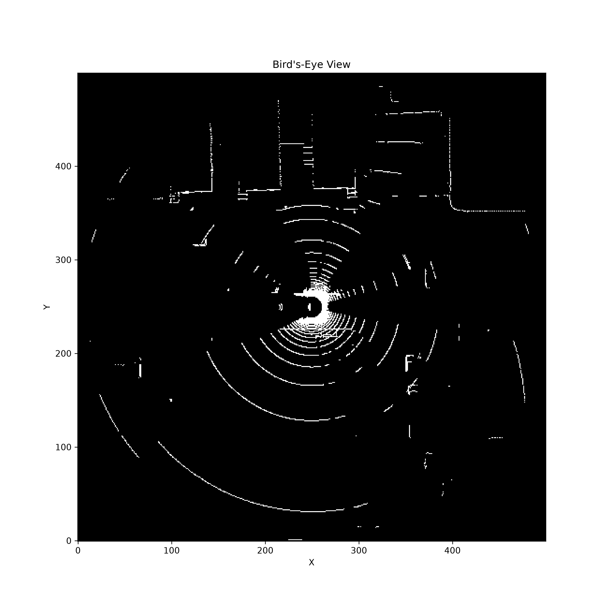
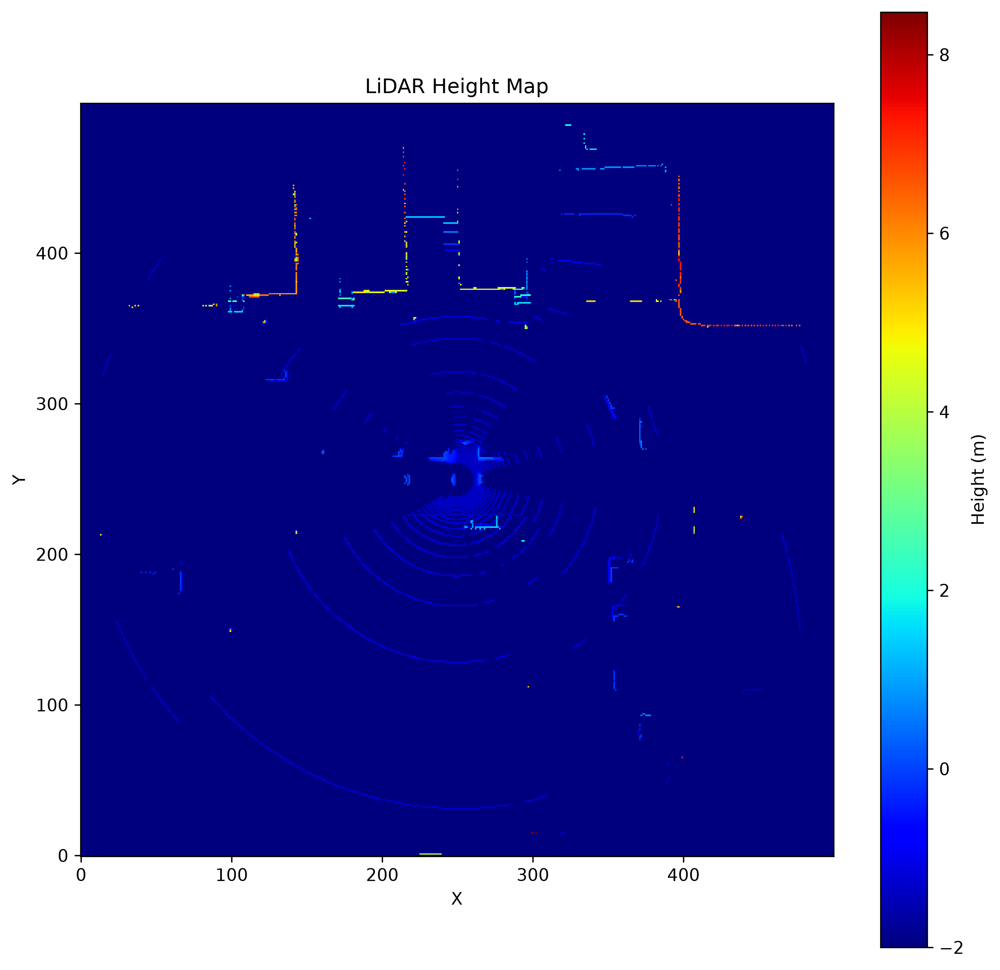
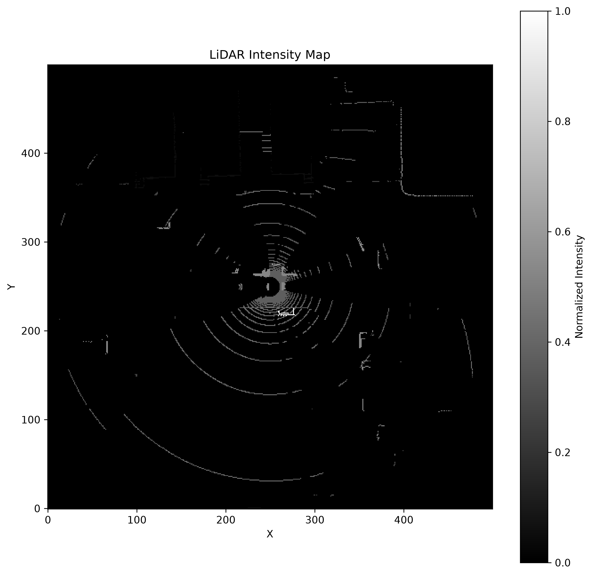
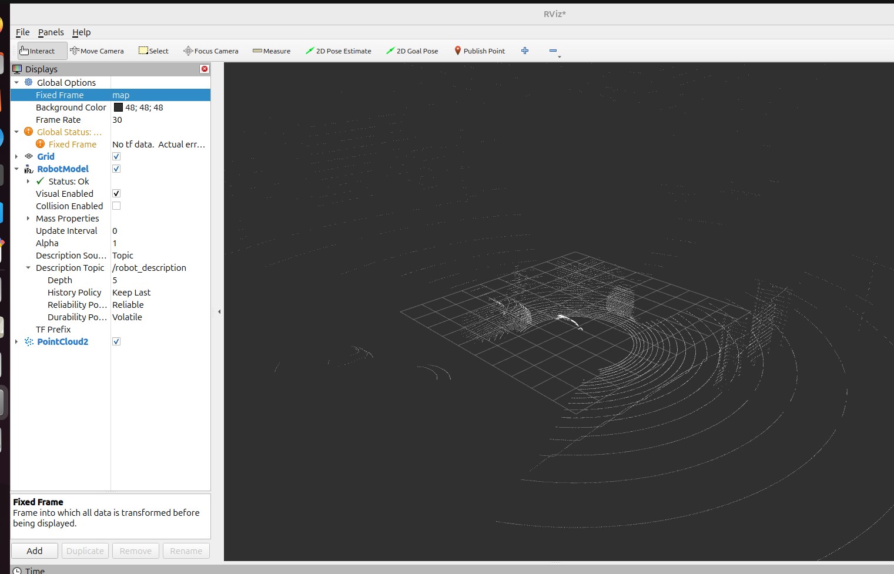

## Sample Visualization

The project supports loading and visualizing LiDAR sweeps from the V2X-Sim 2.0 Mini dataset stored in `.pcd.bin` format.

**Input format:** `(x, y, z, intensity, ring_index)`  
**Sample frame:** `scene_5_000006.pcd.bin`  
**Number of points:** `43,542`

### Raw Point Cloud

## Preprocessing Pipeline

The preprocessing pipeline applies the following steps:

- Remove invalid points (`NaN` and `Inf`)
- Filter points beyond a 50 m radius
- Remove ground points with `z ≤ -2.0 m`

### Filtered Point Cloud

## Bird's-Eye View Generation
This project converts V2X-Sim LiDAR point clouds into 2D occupancy maps.

## Height Map Generation

The height map stores the maximum LiDAR height value for each grid cell in the Bird's-Eye View representation.

Higher values correspond to taller structures such as buildings, poles, and vegetation.

In the visualization below:
Dark blue regions correspond to ground surfaces and low-lying areas.

Green and yellow regions indicate medium-height objects such as vehicles and roadside structures.

Orange and red regions represent tall objects, including buildings, poles, and walls.

## Intensity Map Generation

The intensity map stores the maximum LiDAR reflectance value for each Bird's-Eye View grid cell.

Higher intensity values correspond to highly reflective surfaces such as lane markings, road signs, and metallic objects.
The color bar on the right ranges from 0 to 1 because you normalized the values.

Black (0.0): No points or very low reflectivity

Dark gray: Weak reflections

Light gray to white (1.0): Strong reflections

The below intensity map shows: 

The bright central region is the area closest to the LiDAR sensor, where returns are strongest.

The white arcs indicate highly reflective surfaces.

The faint outer rings are weaker returns due to increasing distance.

The bright structures at the top are likely building facades or reflective roadside objects.

  

## ROS 2 and RViz Integration

The processed LiDAR point cloud is published as a ROS 2 `sensor_msgs/msg/PointCloud2` message and visualized in RViz.

This enables integration with robotics pipelines for localization, mapping, perception and navigation.

